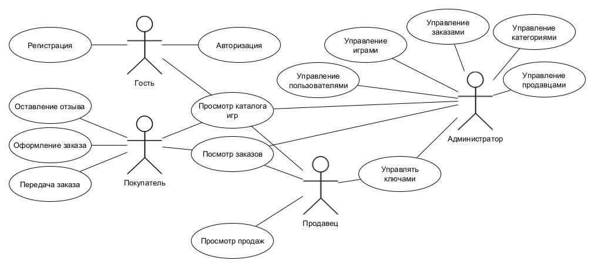

# 1\. Название проекта

Gamesbakery

# 2\. Краткое описание идеи проекта

Данный проект представляет собой систему для продажи цифровых копий (ключей) видеоигр, их классификации по жанрам и ведения учёта заказов от пользователей. Система позволяет регистрировать новых пользователей, оформлять заказы и оставлять отзывы на игры. Также система предоставляет инструменты для анализа продаж и управления базой данных игр и разработчиков.

# 3\. Краткое описание предметной области

В онлайн-магазине цифровых ключей для видеоигр участвуют:

Покупатели (Users), которые могут просматривать каталог ключей, оформлять заказы, оставлять отзывы и рейтинги.

Продавцы (Sellers / Издатели), выступающие официальными или партнёрскими поставщиками ключей (это может быть сам разработчик игры, издательство или официальный дистрибьютор, предоставляющий ключи для продажи). Они загружают информацию о своих товарах, указывают цену и количество доступных ключей.

Администраторы (Admins), контролирующие целостность и актуальность базы ключей, следящие за категориями (жанрами), обработкой заказов и системой отзывов.

Однако во многих современных магазинах видеоигр отсутствует удобная система покупки сразу нескольких копий одной игры, которую затем можно было бы поштучно раздавать различным пользователям (или даже оставлять себе «про запас»). Чаще всего механика дарения ограничивается покупкой одной копии «в подарок», без возможности гибкой передачи уже купленных дополнительных экземпляров другим участникам.

# 4\. Краткий анализ аналогичных решений по минимум 3 критериям

Решение                                      | Модель размещения ключей | Система отзывов | Покупка нескольких ключей
-------------------------------------------- | ------------------ | -------------- | ----------------------
[Steampay](https://steampay.com/)         |   Размещают проверенные продавцы                | Комментарии              | Покупка одной подарочной копии                      |
[Kupikod](https://kupikod.com/)   | Размещают официальные и частные лица                  | Звездная оценка              | Отсутсвует                      |
[Zaka-zaka](https://zaka-zaka.com/) | Размещают проверенные продавцы/издатели                  | Отсутствует             | Покупка нескольких копий                      |
Предлагаемое решение                         | Размещают проверенные продавцы                  | Комментарии+Звезды              | Покупка нескольких копий с возможностью передачи                     |

# 5\. Краткое обоснование целесообразности и актуальности проекта

Проект создаётся для геймеров и дистрибьюторов, которым важно быстро и безопасно покупать, продавать и дарить цифровые копии игр. Сервис предлагает удобный механизм приобретения сразу нескольких ключей и их последующей передачи.

# 6\. Краткое описание акторов (ролей)

В проекте определены следующие роли:

- Гость (Guest) — неавторизованный пользователь, может просматривать общую информацию об играх, но не может оформлять заказы и оставлять отзывы.
- Покупатель (User) — регистрируется в системе, просматривает каталог игр, оформляет заказ, оставляет отзывы.
- Продавец (Seller) — выпускает игры в системе, может редактировать описание своих проектов (в реальной системе — через админку или соглашения с площадкой).
- Администратор (Admin) — управляет данными об играх, категориях, следит за статусами заказов и отзывами.

# 7\. Use-Case - диаграмма

# 8\. ER-диаграмма сущностей

# 9\. Пользовательские сценарии

**Сценарий 1: Регистрация нового пользователя**

<ol type="I">
 <li>Гость</li>
  <ol type="1">
   <li>Открывает сайт магазина</li>
    <li>Выбирает «Зарегистрироваться»</li>
     <li>Заполняет форму (имя, email, пароль, страна и т.д.)</li>
      <li>Система выполняет валидацию данных</li>
       <li>Система создаёт нового пользователя</li>
        <li>Система перенаправляет в личный кабинет</li>
  </ol>
</ol>

**Сценарий 2: Оформление заказа**

<ol type="I">
 <li>Пользователь</li>
 <ol type="1">
  <li>Авторизуется в системе</li>
  <li>Добавляет нужные игры в корзину</li>
  <li>Переходит в «Корзину»</li>
  <li>Выбирает «Оформить заказ»</li>
  <li>Система рассчитывает общую стоимость</li>
  <li>Пользователь подтверждает заказ</li>
  <li>Система оплачивает с баланса пользователя за заказ, фиксирует заказ в базе данных и меняет его статус на «оплачен»</li>
  </ol>
</ol>

**Сценарий 3: Добавление отзыва к игре**

<ol type="I">
 <li>Пользователь</li>
 <ol type="1">
  <li>Находит нужную игру в каталоге и открывает её страницу</li>
  <li>Выбирает пункт «Оставить отзыв»</li>
  <li>Вводит текст отзыва</li>
  <li>Система сохраняет отзыв, связывая его с текущим пользователем и выбранной игрой</li>
  <li>Отзыв появляется на странице игры</li>
   </ol>
</ol>

# 10\. Формализация ключевых бизнес-процессов

")
